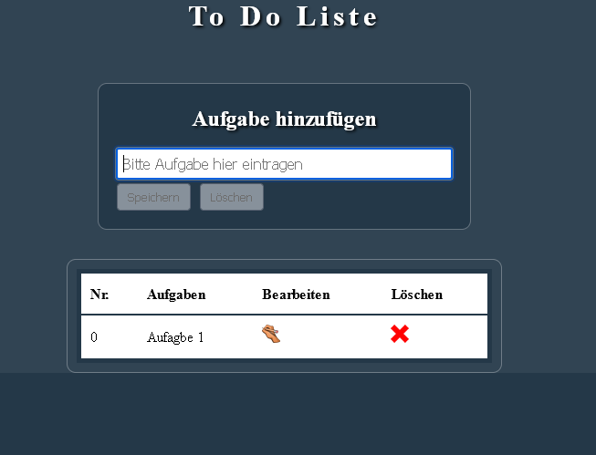

# ToDoList-React
 Einfache ToDo Liste in React
 
ToDo Liste mit React erstellt.

Gespeichert werden die Einträge im Local Storage, verwendung von useState

Zuerst: npm install

Danach zum Starten: npm run dev

Eine Vorschau ist hier zu finden:

https://todolist-react-v1-js.netlify.app/

